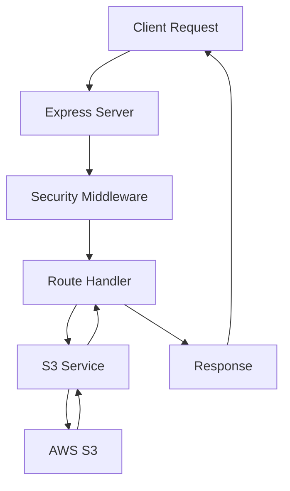

# Design Document

## Overview

This design outlines a minimal Express.js server built with TypeScript and ESM that serves a single "hello world" text file from Amazon S3. The server exposes one GET endpoint and implements essential security middleware while maintaining a lightweight architecture.

## Architecture

The application follows a simple three-layer architecture:

1. **HTTP Layer**: Express.js server with minimal middleware
2. **Service Layer**: S3 service for file retrieval operations
3. **Infrastructure Layer**: AWS S3 client configuration and error handling



## Components and Interfaces

### 1. Server Configuration

- **File**: `src/config/index.ts`
- **Purpose**: Centralized configuration management using environment variables
- **Interface**:

```typescript
interface ServerConfig {
  port: number;
  aws: {
    region: string;
    bucketName: string;
    fileName: string;
  };
}
```

### 2. S3 Service

- **File**: `src/services/s3Service.ts`
- **Purpose**: Handles S3 file retrieval operations
- **Interface**:

```typescript
interface S3Service {
  getHelloWorldFile(): Promise<string>;
}
```

### 3. Express Application

- **File**: `src/app.ts`
- **Purpose**: Express server setup with middleware and routing
- **Components**:
  - Security middleware (helmet)
  - Single GET route handler
  - Error handling middleware

### 4. Main Entry Point

- **File**: `src/index.ts`
- **Purpose**: Application bootstrap and server startup

## Data Models

### Configuration Model

```typescript
interface Config {
  port: number;
  aws: {
    region: string;
    bucketName: string;
    fileName: string;
    accessKeyId?: string;
    secretAccessKey?: string;
  };
}
```

### Error Response Model

```typescript
interface ErrorResponse {
  error: string;
  message: string;
  statusCode: number;
}
```

## Error Handling

### Error Categories and HTTP Status Codes

1. **File Not Found (404)**

   - S3 object does not exist
   - Bucket does not exist

2. **Service Unavailable (503)**

   - S3 service is down
   - Network connectivity issues

3. **Internal Server Error (500)**
   - Authentication/authorization failures
   - Unexpected AWS SDK errors
   - Configuration errors

### Error Handling Strategy

- **Centralized Error Middleware**: Express error handling middleware to catch and format all errors
- **Logging**: All errors logged with appropriate detail level
- **Client Response**: Generic error messages to avoid exposing internal details

```typescript
interface ErrorHandler {
  handleS3Error(error: AWS.AWSError): ErrorResponse;
  logError(error: Error, context: string): void;
}
```

## Testing Strategy

### Unit Tests

- **S3 Service**: Mock AWS SDK calls to test error handling and success scenarios
- **Configuration**: Test environment variable parsing and validation
- **Route Handlers**: Test HTTP responses for various scenarios

### Integration Tests

- **End-to-End**: Test complete request flow with mocked S3 responses
- **Error Scenarios**: Test all error conditions and appropriate HTTP status codes

### Test Structure

```
tests/
├── unit/
│   ├── services/
│   │   └── s3Service.test.ts
│   ├── config/
│   │   └── index.test.ts
│   └── app.test.ts
└── integration/
    └── server.test.ts
```

## Dependencies

### Production Dependencies

- `express`: Web framework
- `helmet`: Security middleware
- `@aws-sdk/client-s3`: AWS S3 client (v3)
- `dotenv`: Environment variable loading

### Development Dependencies

- `typescript`: TypeScript compiler
- `@types/express`: Express type definitions
- `@types/node`: Node.js type definitions
- `vitest`: Testing framework
- `supertest`: HTTP testing
- `ts-node`: TypeScript execution
- `nodemon`: Development server

## Security Considerations

- **Helmet Middleware**: Basic security headers (XSS protection, content type sniffing prevention)
- **Environment Variables**: Sensitive AWS credentials stored in environment variables
- **Error Messages**: Generic error responses to prevent information leakage
- **HTTPS**: Application designed to run behind HTTPS proxy in production

## Deployment Configuration

The application expects the following environment variables:

- `PORT`: Server port (default: 3000)
- `AWS_REGION`: AWS region for S3 bucket
- `AWS_S3_BUCKET_NAME`: S3 bucket name
- `AWS_S3_FILE_NAME`: S3 object key for the hello world file
- `AWS_ACCESS_KEY_ID`: AWS access key (optional if using IAM roles)
- `AWS_SECRET_ACCESS_KEY`: AWS secret key (optional if using IAM roles)
